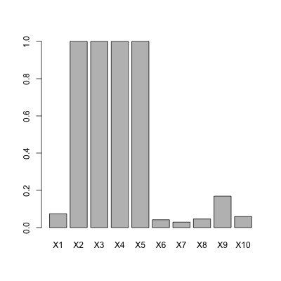
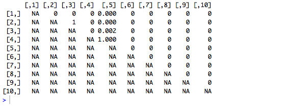
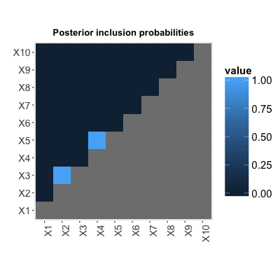
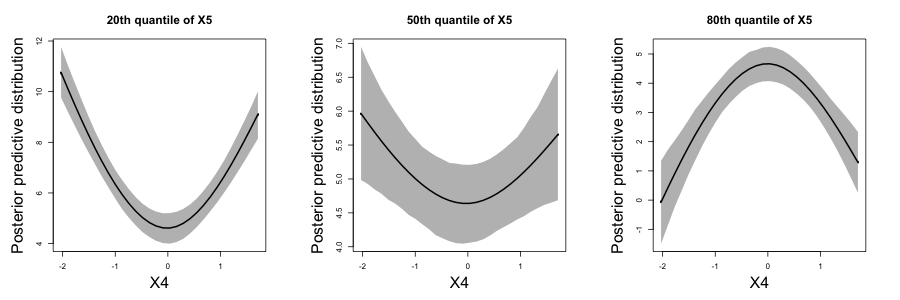

# NLinteraction

This is an R package to implement the ideas in Antonelli et. al (2018), which can be found at the following link:

https://arxiv.org/pdf/1711.11239.pdf

Please don't hesitate to contact Joseph Antonelli with any questions at jantonelli111@gmail.com. Please report any bugs if you encounter any as well!

# How to use NLinteraction

The first thing we need to do is install the library, which can be done using the following

```
library(devtools)
install_github(repo = "jantonelli111/NLinteraction")
library(NLinteraction)
```

So let's generate some data that we can use to illustrate the different functionalities in the package:

```
n = 100
p = 10
pc = 1

X = matrix(rnorm(n*p), n, p)

C = matrix(rnorm(n*pc), nrow=n)

TrueH = function(X) {
  return(1.5*(X[,2]*X[,3]) - 1.6*(X[,4]^2 * X[,5]))
}

Y = 5 + C + TrueH(X) + rnorm(n)
```

So we've generated p=10 exposures that are of interest for this software, one additional covariate that we control for (typically demographic variables, etc.), and an outcome conditional on both of these things. We see that the true relationship between X and Y is nonlinear as there is a squared term. We have intentionally chosen strong signals for this illustration, so that we can clearly see in all of the plots what is happening.

### Main MCMC function

Now we will build our model. The first thing to note is that the number of degrees of freedom of the splines in the model is very important and therefore the model should be built for a few different values of the degrees of freedom and then the WAIC can be used to evaluate which model to proceed with. Here we will choose 2 and 3 degrees of freedom. Degrees of freedom is controlled by the ns parameter in the model. We also must select the number of MCMC iterations we want (nIter), the number to throw out with the burn-in (nBurn), how many samples to thin (thin), and how many chains to run (nChains). Other parameters that control things such as the hyperparameters of the prior distributions in the model can be changed as well, but we recommend using the pre-set values unless their is strong prior information and the user fully understands the prior distributions.

```
NLmod2 = NLint(Y=Y, X=X, C=C, nIter=1000, nBurn=500, thin=2, nChains=2, ns=2)
NLmod3 = NLint(Y=Y, X=X, C=C, nIter=1000, nBurn=500, thin=2, nChains=2, ns=3)
```

So we can now evaluate the WAIC of each model

```
print(c(NLmod2$waic,NLmod3$waic))
```


And we see that the 2 degree of freedom model is preferred so we will continue with inference using that model. Let's call this model NLmod

```
NLmod = NLmod2
```

### Posterior inclusion probabilities

One quantity of interest is the posterior probability that each exposure enters into the model (regardless of the order of interaction). This can be extracted with the following object:

```
NLmod$MainPIP
```


and we can easily visualize them.

```
barplot(NLmod$MainPIP)
```



We can also look at the matrix of two-way interaction probabilities.

```
NLmod$InteractionPIP
```



We have a built-in function to plot the two-way posterior inclusion probabilities

```
plotInt(NLmod = NLmod)
```



We can also calculate any order interaction we want using the following function

```
InteractionProb(NLmod=NLmod, Xsub=c(4,5,9))
```


Which shows that the posterior inclusion probability of a three-way interaction between X4, X5, and X9 is 0. This function can be used to calculate any order interaction, and the order is dictated by the length of Xsub. If Xsub were to instead be simply a scalar, this function would return the marginal inclusion probabilities we first looked at. 

### Visualizing exposure response surfaces

Now that we know which exposures are important for predicting the outcome, we can visualize the associations that our model has identified. There are a number of plotting techniques to do this built into the function and we detail them here. The first function plots 1-dimensional exposure response curves between an exposure of interest and the outcome, while fixing the values of the other exposures. Specifically, the function allows the user to fix the value of one exposure at a given quantile, while the remaining exposures are fixed to a different specific quantile. The reason for doing this is that we might want to see how these curves change as a function of another exposure, if two exposures are interacting. In our example there is an interaction between X4 and X5, so we will plot X4's relationship with the outcome, but at different levels of X5, while fixing the values of the remaining exposures.

```
par(mfrow=c(1,3), pty='s')
plotSurface1d(NLmod = NLmod, X=X, C=C, j1=4, j2=5,
              gridLength=30, quantile_j2=0.2, quantile_rest = 0.5,
              xlab="X4", ylab="Posterior predictive distribution",
              main="20th quantile of X5")
plotSurface1d(NLmod = NLmod, X=X, C=C, j1=4, j2=5,
              gridLength=30, quantile_j2=0.5, quantile_rest = 0.5,
              xlab="X4", ylab="Posterior predictive distribution",
              main="50th quantile of X5")
plotSurface1d(NLmod = NLmod, X=X, C=C, j1=4, j2=5,
              gridLength=30, quantile_j2=0.8, quantile_rest = 0.5,
              xlab="X4", ylab="Posterior predictive distribution",
              main="80th quantile of X5")

```



**References**

Joseph Antonelli, Maitreyi Mazumdar, David Bellinger, David C. Christiani, Robert Wright, Brent A. Coull. **Bayesian variable selection for multi-dimensional semiparametric regression models**. 2018. arXiv:1711.11239
